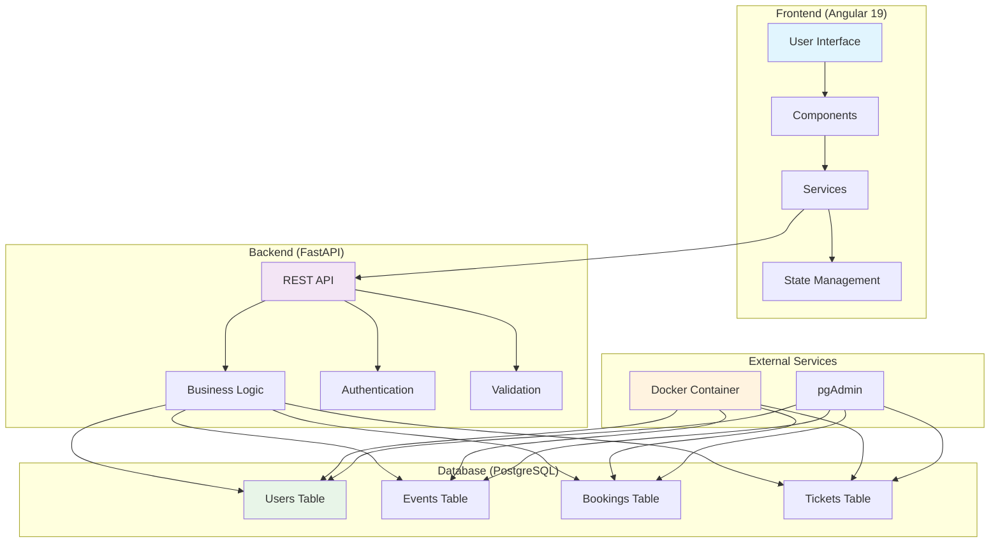
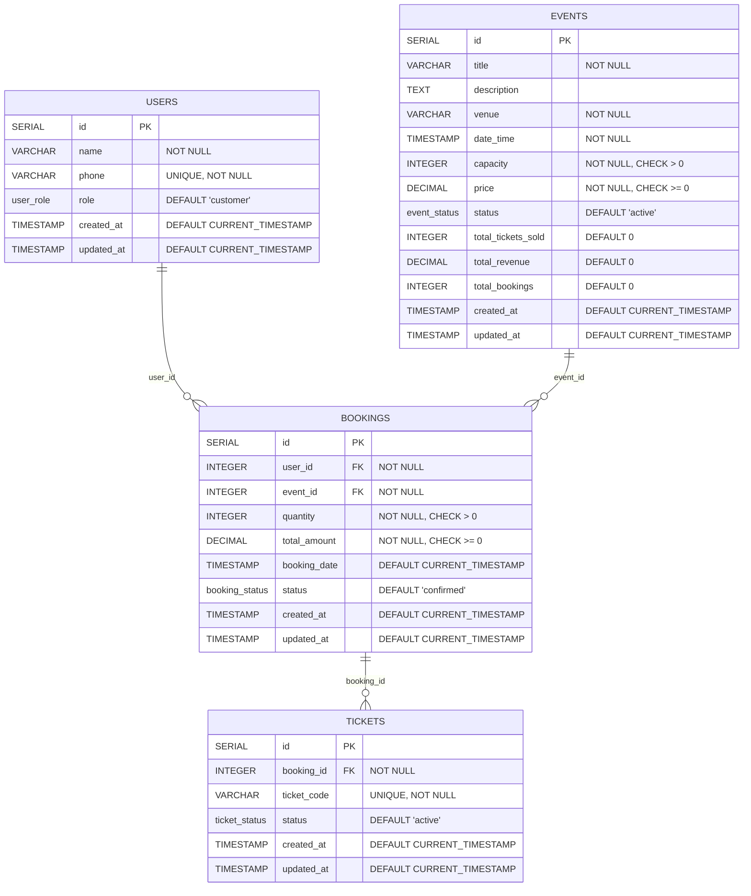
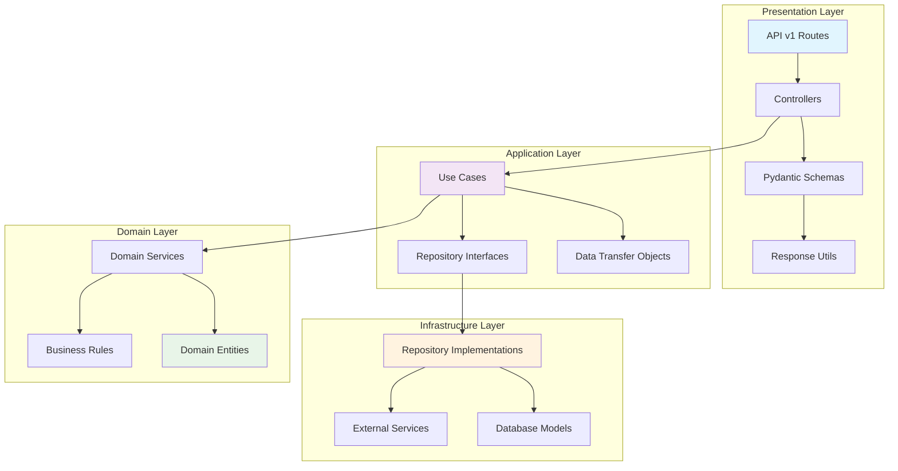
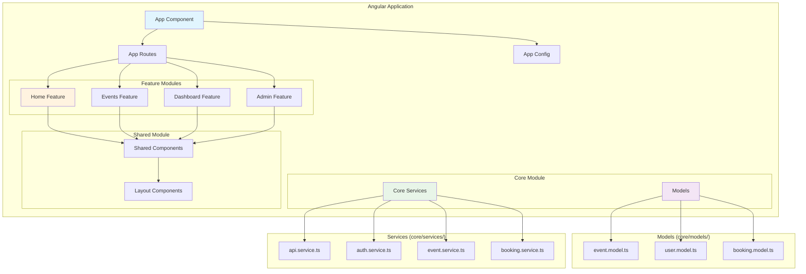
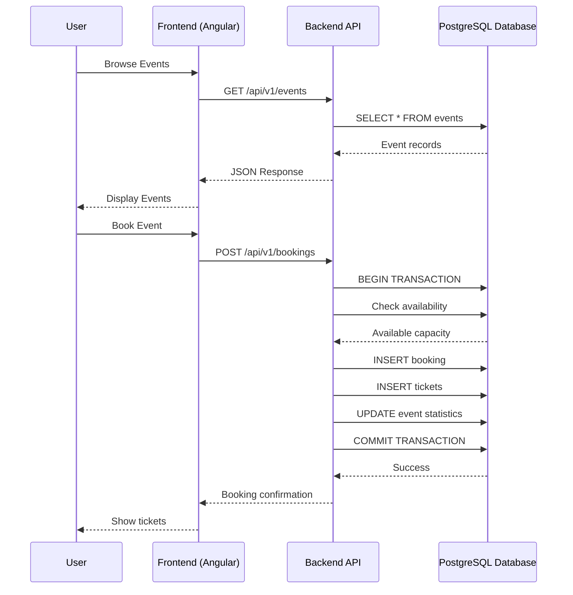
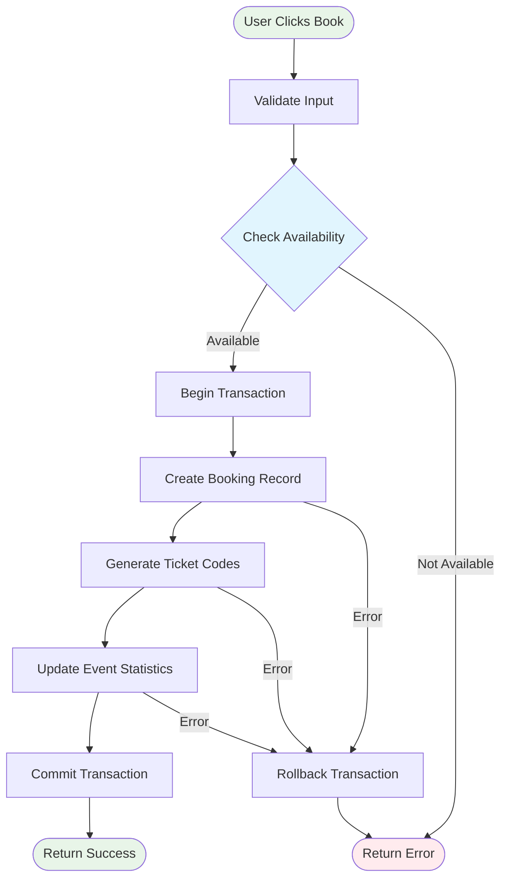
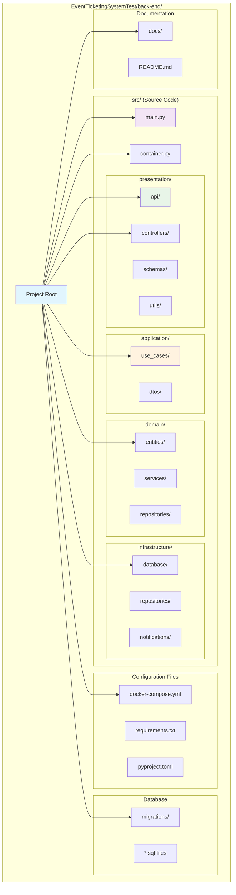
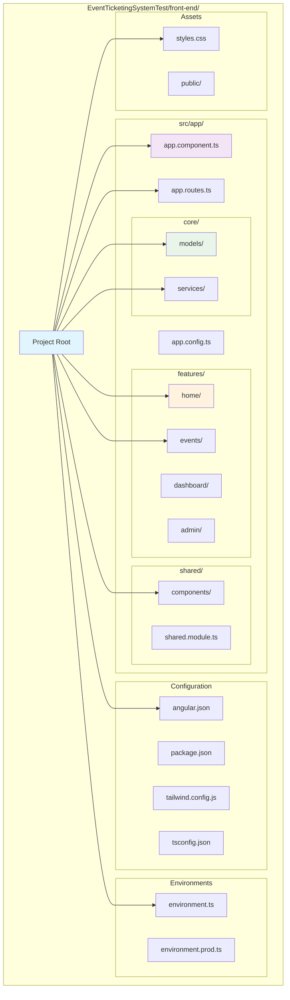

# Event Ticketing System - Complete Project Summary

## 📑 Table of Contents

- [Event Ticketing System - Complete Project Summary](#event-ticketing-system---complete-project-summary)
  - [📑 Table of Contents](#-table-of-contents)
  - [📊 Project Overview and Architecture Decisions](#-project-overview-and-architecture-decisions)
    - [(Frontend: Angular 19)](#frontend-angular-19)
    - [หลังบ้าน (Backend: FastAPI + PostgreSQL)](#หลังบ้าน-backend-fastapi--postgresql)
    - [System Overview](#system-overview)
  - [System Architecture Diagrams](#system-architecture-diagrams)
    - [1. High-Level System Architecture](#1-high-level-system-architecture)
    - [2. Database Schema (ERD)](#2-database-schema-erd)
      - [เหตุผลการออกแบบ Database Schema](#เหตุผลการออกแบบ-database-schema)
      - [Trade-off](#trade-off)
    - [3. Backend Clean Architecture Structure](#3-backend-clean-architecture-structure)
    - [4. Frontend Angular Architecture](#4-frontend-angular-architecture)
    - [5. API Request Flow](#5-api-request-flow)
    - [6. Database Transaction Flow (Booking Process)](#6-database-transaction-flow-booking-process)
    - [7. File Structure (Backend)](#7-file-structure-backend)
    - [8. File Structure (Frontend)](#8-file-structure-frontend)
    - [Clean Architecture Implementation](#clean-architecture-implementation)
    - [Key Architecture Decisions](#key-architecture-decisions)
  - [🛠️ Local Setup Instructions (Step-by-Step)](#️-local-setup-instructions-step-by-step)
    - [Prerequisites](#prerequisites)
    - [Backend Setup](#backend-setup)
    - [Frontend Setup](#frontend-setup)
    - [Verification Steps](#verification-steps)
    - [Troubleshooting](#troubleshooting)
  - [📚 API Documentation (Endpoints and Examples)](#-api-documentation-endpoints-and-examples)
    - [API Endpoints Summary (Admin Required not yet implement)](#api-endpoints-summary-admin-required-not-yet-implement)
      - [Events Management](#events-management)
      - [User Management](#user-management)
      - [Booking Management](#booking-management)
      - [Event Availability](#event-availability)
    - [Response Format Examples](#response-format-examples)
      - [Success Response (Single Item)](#success-response-single-item)
      - [Success Response (List)](#success-response-list)
      - [Error Response](#error-response)
      - [Validation Error Response](#validation-error-response)
  - [🎯 Design Decisions and Trade-offs](#-design-decisions-and-trade-offs)
    - [Authentication Strategy](#authentication-strategy)
    - [Database Design](#database-design)
    - [API Design](#api-design)
    - [Real-time Strategy](#real-time-strategy)
    - [Frontend Architecture](#frontend-architecture)
  - [⚠️ Known Limitations or Areas for Improvement](#️-known-limitations-or-areas-for-improvement)
    - [Security Limitations](#security-limitations)
    - [Performance Limitations](#performance-limitations)
    - [Scalability Concerns](#scalability-concerns)
    - [Business Logic Gaps](#business-logic-gaps)
    - [Technical Debt](#technical-debt)
    - [User Experience Issues](#user-experience-issues)
    - [Immediate Next Steps (Priority Order)](#immediate-next-steps-priority-order)
    - [Long-term Roadmap](#long-term-roadmap)
  - [สมมติฐาน (Assumptions)](#สมมติฐาน-assumptions)
  - [About RealTime Ticket Avalible](#about-realtime-ticket-avalible)
  - [🎬 Preview Videos](#-preview-videos)
    - [📅 Event Browsing \& Booking Process](#-event-browsing--booking-process)
    - [📊 My Bookings Dashboard](#-my-bookings-dashboard)
    - [⚡ Real-Time Availability Updates](#-real-time-availability-updates)
    - [🛠️ Admin Panel - Event Management](#️-admin-panel---event-management)
    - [❌ Event Cancellation Process](#-event-cancellation-process)
    - [🔧 Developer Mode \& API Demo](#-developer-mode--api-demo)

---

## 📊 Project Overview and Architecture Decisions

### (Frontend: Angular 19)

- **Framework:** Angular 19  
   เลือกเพราะรองรับ Standalone Components, SSR, และมี ecosystem ใหญ่
- **Styling:** TailwindCSS  
   ช่วยให้พัฒนา UI ได้รวดเร็วและปรับแต่งง่าย
- **State Management:** RxJS  
   ใช้สำหรับจัดการข้อมูลและ event ภายในแอปอย่างมีประสิทธิภาพ
- **Architecture:** Feature-based Architecture แบ่งเป็น Core, Feature, Shared  
   เพื่อแยกความรับผิดชอบและเพิ่มความคล่องตัวในการพัฒนา
- **เหตุผล:** Modular, ทดสอบง่าย, ขยายฟีเจอร์ใหม่ได้รวดเร็ว, รองรับ SEO และ performance

### หลังบ้าน (Backend: FastAPI + PostgreSQL)

- **Framework:** FastAPI  
   รองรับ async, พัฒนา API ได้เร็ว, มี interactive docs
- **Database:** PostgreSQL (ผ่าน Docker)  
   มาตรฐานอุตสาหกรรม, ACID, scale ได้ดี
- **ORM:** Tortoise ORM  
   ช่วย mapping ข้อมูลระหว่าง Python กับฐานข้อมูล
- **Validation:** Pydantic  
   ตรวจสอบข้อมูลเข้าออก API อย่างปลอดภัย
- **Architecture:** Clean Architecture  
   แบ่งเป็น Presentation, Application, Domain, Infrastructure

**Trade-off ของ Clean Architecture**

- ข้อดี: แยกความรับผิดชอบแต่ละส่วนชัดเจน ทดสอบและดูแลรักษาง่าย, สามารถเปลี่ยนเทคโนโลยีหรือฐานข้อมูลได้โดยไม่กระทบ business logic, รองรับการขยายระบบและเพิ่มฟีเจอร์ใหม่ได้ง่าย
- ข้อเสีย: โครงสร้างไฟล์และ abstraction ซับซ้อนขึ้น ต้องใช้เวลาเรียนรู้, อาจมี boilerplate code มากกว่าการเขียนแบบทั่วไป

### System Overview

## System Architecture Diagrams

### 1. High-Level System Architecture



### 2. Database Schema (ERD)

#### เหตุผลการออกแบบ Database Schema

- แยก Entity หลัก (USERS, EVENTS, BOOKINGS, TICKETS) เพื่อความชัดเจนและรองรับการขยายฟีเจอร์ในอนาคต
- ใช้ Foreign Key เพื่อรักษาความสัมพันธ์และความถูกต้องของข้อมูล (เช่น user_id, event_id, booking_id)
- มี computed fields (เช่น total_tickets_sold, total_revenue, total_bookings) ใน EVENTS เพื่อให้ดึงสถิติได้รวดเร็ว ลด N+1 Query
- ใช้ status field (เช่น event_status, booking_status, ticket_status) เพื่อรองรับ soft delete และการเปลี่ยนสถานะโดยไม่ลบข้อมูลจริง
- กำหนด constraint เช่น capacity > 0, price >= 0, quantity > 0 เพื่อป้องกันข้อมูลผิดพลาดตั้งแต่ระดับฐานข้อมูล
- ใช้ timestamp (created_at, updated_at) เพื่อเก็บประวัติการเปลี่ยนแปลงและ audit trail

#### Trade-off

- การมี computed fields ในตาราง EVENTS ทำให้ query สถิติเร็วขึ้น แต่เพิ่มความซับซ้อนในการ update (ต้องใช้ trigger หรือ logic เพิ่มเติม)
- Soft delete ด้วย status field ช่วยเก็บประวัติและ audit ได้ดี แต่ข้อมูลจะไม่ถูกลบจริง อาจต้องจัดการข้อมูลค้างในระยะยาว
- การใช้ Foreign Key เพิ่มความถูกต้องของข้อมูล แต่ถ้าต้อง scale อาจต้องพิจารณาเรื่อง performance และการทำ sharding
- Constraint ที่เข้มงวดช่วยป้องกันข้อมูลผิดพลาด แต่ถ้าต้องการความยืดหยุ่นสูงอาจต้องปรับลด constraint บางส่วน
- การแยกตาราง TICKETS ออกจาก BOOKINGS ทำให้รองรับการขยายฟีเจอร์ ticket ได้ง่าย (เช่น QR code, validation) แต่เพิ่มจำนวน join ใน query
- การใช้ timestamp ทุกตารางช่วยในการ audit แต่เพิ่ม storage และอาจไม่ได้ใช้ทุกกรณี



### 3. Backend Clean Architecture Structure



### 4. Frontend Angular Architecture



### 5. API Request Flow



### 6. Database Transaction Flow (Booking Process)



### 7. File Structure (Backend)



### 8. File Structure (Frontend)



### Clean Architecture Implementation

```
├── Domain Layer (entities/)          # Business entities and rules
├── Application Layer (use_cases/)    # Business logic orchestration
├── Infrastructure Layer (repositories/, database/) # External concerns
└── Presentation Layer (api/, controllers/) # HTTP/UI concerns
```

### Key Architecture Decisions

| Decision                       | Rationale                                            | Trade-offs                                                   |
| ------------------------------ | ---------------------------------------------------- | ------------------------------------------------------------ |
| **Clean Architecture**         | Separation of concerns, testability, maintainability | More complex folder structure, additional abstraction layers |
| **API Versioning (URL-based)** | Backward compatibility, clear migration path         | URL namespace complexity                                     |
| **PostgreSQL + Docker**        | ACID compliance, robust constraints, easy deployment | Setup complexity vs SQLite                                   |
| **Computed Fields in DB**      | Real-time statistics without N+1 queries             | Database-level logic, harder to unit test                    |
| **No Real Authentication**     | Focus on business logic for demo                     | Security limitations for production                          |

---

## 🛠️ Local Setup Instructions (Step-by-Step)

### Prerequisites

- **Node.js** 18+ with npm 9+
- **Python** 3.9+
- **Docker** & Docker Compose
- **Git**

### Backend Setup

1. **Navigate to Backend Directory**

   ```bash
   cd EventTicketingSystemTest/back-end
   ```

2. **Install Python Dependencies**

   ```bash
   pip install -r requirements.txt
   ```

3. **Start PostgreSQL Database**

   ```bash
   docker-compose up -d
   ```

   This starts PostgreSQL on port 5432 with credentials:

   - Database: `event_ticketing`
   - Username: `postgres`
   - Password: `password123`

4. **Apply Database Migrations**

   ```bash
   ./run_migrations.sh up
   ```

5. **Create Sample Data**

   ```bash
   python create_sample_data.py
   ```

6. **Start Backend Server**

   ```bash
   # Using FastAPI dev server (recommended)
   fastapi dev src/main.py

   # Or using uvicorn directly
   uvicorn src.main:app --reload
   ```

   **Backend URLs:**

   - API: http://localhost:8000
   - Interactive Docs: http://localhost:8000/docs
   - ReDoc: http://localhost:8000/redoc

### Frontend Setup

1. **Navigate to Frontend Directory**

   ```bash
   cd EventTicketingSystemTest/front-end
   ```

2. **Install Dependencies**

   ```bash
   npm install
   ```

3. **Start Development Server**

   ```bash
   ng serve
   # or
   npm start
   ```

   **Frontend URL:** http://localhost:4200

### Verification Steps

1. **Check Backend Health**

   ```bash
   curl http://localhost:8000/api
   ```

2. **Check Database Connection**

   ```bash
   curl http://localhost:8000/api/v1/events
   ```

3. **Access Frontend**
   - Open http://localhost:4200
   - Should show event listing with sample data

### Troubleshooting

| Issue                      | Solution                                                         |
| -------------------------- | ---------------------------------------------------------------- |
| Database connection failed | Check if Docker is running: `docker ps`                          |
| Port 8000 already in use   | Kill existing process: `lsof -ti:8000 \| xargs kill -9`          |
| Migration errors           | Reset database: `docker-compose down -v && docker-compose up -d` |
| Frontend build errors      | Clear cache: `npm ci`                                            |

---

## 📚 API Documentation (Endpoints and Examples)

### API Endpoints Summary (Admin Required not yet implement)

#### Events Management

| Method   | Endpoint                         | Description                           | Admin Required |
| -------- | -------------------------------- | ------------------------------------- | -------------- |
| `POST`   | `/api/v1/events`                 | Create a new event                    | ✅             |
| `GET`    | `/api/v1/events`                 | Get all events                        | ❌             |
| `GET`    | `/api/v1/events/{event_id}`      | Get event by ID                       | ❌             |
| `PUT`    | `/api/v1/events/{event_id}`      | Update event completely               | ✅             |
| `PATCH`  | `/api/v1/events/{event_id}`      | Partially update event                | ✅             |
| `DELETE` | `/api/v1/events/{event_id}`      | Delete event                          | ✅             |
| `GET`    | `/api/v1/events/management/view` | Get events with management statistics | ✅             |

#### User Management

| Method | Endpoint                  | Description       | Admin Required |
| ------ | ------------------------- | ----------------- | -------------- |
| `POST` | `/api/v1/users`           | Create a new user | ❌             |
| `GET`  | `/api/v1/users`           | Get all users     | ❌             |
| `GET`  | `/api/v1/users/{user_id}` | Get user by ID    | ❌             |

#### Booking Management

| Method | Endpoint                                  | Description                                         | Admin Required |
| ------ | ----------------------------------------- | --------------------------------------------------- | -------------- |
| `POST` | `/api/v1/bookings`                        | Create new booking with automatic ticket generation | ❌             |
| `GET`  | `/api/v1/bookings/{booking_id}`           | Get booking by ID with full details                 | ❌             |
| `GET`  | `/api/v1/bookings/user/{user_id}`         | Get all bookings for specific user                  | ❌             |
| `GET`  | `/api/v1/bookings/event/{event_id}`       | Get all bookings for specific event                 | ✅             |
| `GET`  | `/api/v1/bookings/event/{event_id}/stats` | Get booking statistics for event                    | ❌             |
| `PUT`  | `/api/v1/bookings/{booking_id}/status`    | Update booking status                               | ❌             |

#### Event Availability

| Method | Endpoint                                  | Description                                   | Admin Required |
| ------ | ----------------------------------------- | --------------------------------------------- | -------------- |
| `GET`  | `/api/v1/event-availability/{event_id}`   | Get real-time availability for specific event | ❌             |
| `GET`  | `/api/v1/event-availability?event_ids=[]` | Get availability for multiple events          | ❌             |
| `GET`  | `/api/v1/event-availability/all/active`   | Get availability for all active events        | ❌             |

**Summary:** 20 Total Endpoints | 14 Public | 6 Admin Required

### Response Format Examples

#### Success Response (Single Item)

```json
{
  "success": true,
  "message": "User retrieved successfully",
  "data": {
    "id": 1,
    "name": "John Doe",
    "phone": "0812345678",
    "role": "customer"
  }
}
```

#### Success Response (List)

```json
{
  "success": true,
  "message": "Events retrieved successfully",
  "data": [
    {
      "id": 1,
      "title": "Concert",
      "venue": "Arena"
    }
  ]
}
```

#### Error Response

```json
{
  "success": false,
  "message": "Event not found",
  "data": null
}
```

#### Validation Error Response

```json
{
  "success": false,
  "message": "Validation failed",
  "data": {
    "errors": [
      {
        "field": "capacity",
        "message": "Must be greater than 0"
      }
    ]
  }
}
```

---

## 🎯 Design Decisions and Trade-offs

### Authentication Strategy

| Decision                 | Implementation              | Rationale                                  | Trade-offs                                  |
| ------------------------ | --------------------------- | ------------------------------------------ | ------------------------------------------- |
| **No Real Auth**         | Dev mode with user selector | Focus on business logic, rapid development | ❌ Not production-ready ✅ Fast development |
| **Header-based User ID** | `X-User-Id` header          | Simple user switching for testing          | ❌ No security ✅ Easy role testing         |

### Database Design

| Decision            | Implementation                      | Rationale                           | Trade-offs                            |
| ------------------- | ----------------------------------- | ----------------------------------- | ------------------------------------- |
| **Computed Fields** | Database triggers for statistics    | Real-time stats without N+1 queries | ❌ DB logic complexity ✅ Performance |
| **Soft Deletes**    | Status-based (cancelled vs deleted) | Preserve booking history            | ❌ Data retention ✅ Audit trail      |
| **Ticket Codes**    | `TKT-YYYYMMDD-XXXXXXXX` format      | Human-readable, unique              | ❌ Not scannable ✅ Simple and unique |

### API Design

| Decision                   | Implementation           | Rationale                 | Trade-offs                                        |
| -------------------------- | ------------------------ | ------------------------- | ------------------------------------------------- |
| **Versioned URLs**         | `/api/v1/` prefix        | Backward compatibility    | ❌ URL complexity ✅ Future-proof                 |
| **Standardized Responses** | `{success, data}` format | Consistent error handling | ❌ Extra wrapper ✅ Predictable format            |
| **RESTful Design**         | Standard HTTP methods    | Industry standard         | ❌ May not fit all use cases ✅ Familiar patterns |

### Real-time Strategy

| Approach               | When to Use                            | Pros                              | Cons                                     |
| ---------------------- | -------------------------------------- | --------------------------------- | ---------------------------------------- |
| **Interval Polling**   | Small projects, prototypes             | Simple, no persistent connections | Not truly real-time, high request volume |
| **WebSocket (Custom)** | Full control needed                    | True real-time, customizable      | Complex scaling, reconnection logic      |
| **Pusher/Ably**        | Real-time without WebSocket complexity | Managed scaling, rich features    | Cost per connection, vendor lock-in      |
| **Firebase Realtime**  | Serverless approach                    | Easy real-time, good scaling      | Read/write costs, ecosystem lock-in      |
| **Supabase Realtime**  | Postgres + real-time needs             | SQL power + real-time             | Throughput limits, pricing tiers         |

**Current Implementation**: Polling-based refresh (chosen for simplicity)

### Frontend Architecture

| Decision            | Implementation             | Rationale                     | Trade-offs                              |
| ------------------- | -------------------------- | ----------------------------- | --------------------------------------- |
| **Angular 19**      | Standalone components, SSR | Modern framework, performance | Learning curve, frequent updates        |
| **TailwindCSS**     | Utility-first styling      | Rapid UI development          | Large CSS bundle, class name complexity |
| **Dev Mode Toggle** | Mock data vs real API      | Development flexibility       | Additional complexity                   |

---

## ⚠️ Known Limitations or Areas for Improvement

### Security Limitations

| Issue                | Current State                      | Production Requirement                   |
| -------------------- | ---------------------------------- | ---------------------------------------- |
| **Authentication**   | No real auth system                | JWT/OAuth implementation                 |
| **Authorization**    | Basic role checking                | RBAC with proper middleware              |
| **Input Validation** | Basic Pydantic validation          | SQL injection prevention, XSS protection |
| **API Security**     | No rate limiting, No user checking | Rate limiting, API keys                  |
| **Data Privacy**     | No encryption                      | PII encryption, GDPR compliance          |

### Performance Limitations

| Issue                     | Current Impact           | Improvement Strategy          |
| ------------------------- | ------------------------ | ----------------------------- |
| **No Caching**            | Database hit per request | Redis caching layer           |
| **No Pagination**         | All records loaded       | Cursor-based pagination       |
| **No Connection Pooling** | Limited concurrent users | Connection pool configuration |
| **Real-time Updates**     | Polling interval API     | WebSocket/SSE implementation  |
| **Image Handling**        | No event images          | CDN integration               |

### Scalability Concerns

| Area                    | Current Limitation       | Scaling Solution           |
| ----------------------- | ------------------------ | -------------------------- |
| **Concurrent Bookings** | Race conditions possible | Optimistic locking, queues |
| **Database**            | Single instance          | Read replicas, sharding    |
| **File Storage**        | Local file system        | Cloud storage (S3, GCS)    |
| **Monitoring**          | No observability         | APM, logging, metrics      |
| **Deployment**          | Development only         | Container orchestration    |

### Business Logic Gaps

| Feature                 | Current State          | Business Impact             |
| ----------------------- | ---------------------- | --------------------------- |
| **Payment Processing**  | Price calculation only | No revenue generation       |
| **Refund Management**   | Status change only     | No financial reconciliation |
| **Event Categories**    | No categorization      | Limited discoverability     |
| **Pricing Tiers**       | Fixed pricing only     | No dynamic pricing          |
| **Capacity Management** | Simple counting        | No waitlists, overbooking   |

### Technical Debt

| Component          | Issue                  | Remediation                           |
| ------------------ | ---------------------- | ------------------------------------- |
| **Error Handling** | Generic error messages | Specific error codes, i18n            |
| **Testing**        | No Test                | Unit, integration, e2e tests          |
| **Documentation**  | API docs only          | Architecture docs, deployment guides  |
| **Code Quality**   | Prettier               | ESLint, Prettier, pre-commit hooks    |
| **Type Safety**    | Basic typing           | Strict TypeScript, runtime validation |

### User Experience Issues

| Issue                 | Impact             | Solution                                   |
| --------------------- | ------------------ | ------------------------------------------ |
| **Loading States**    | Poor feedback      | Skeleton screens, progress indicators      |
| **Error Messages**    | Technical jargon   | User-friendly messages                     |
| **Mobile Experience** | Basic responsive   | Progressive Web App                        |
| **Accessibility**     | Not WCAG compliant | Screen reader support, keyboard navigation |
| **Offline Support**   | None               | Service worker, offline queue              |

### Immediate Next Steps (Priority Order)

1. **Security**: Implement JWT authentication
2. **Performance**: Add Redis caching and pagination
3. **Real-time**: WebSocket for live availability
4. **Testing**: Comprehensive test suite
5. **Monitoring**: Health checks and logging
6. **Deployment**: Production-ready Docker setup

### Long-term Roadmap

- **Microservices**: Split into event, booking, user services
- **Event Sourcing**: Audit trail and replay capability
- **Machine Learning**: Demand forecasting, dynamic pricing
- **Multi-tenancy**: Support multiple event organizers
- **International**: Multi-currency, timezone support

## สมมติฐาน (Assumptions)

| Area                 | จุดที่ไม่ชัดเจน / ต้องสมมติเอง                           | สมมติฐานที่กำหนด                                                        | เหตุผล / หมายเหตุ                                   | Trade-offs (ข้อแลกเปลี่ยน)                            |
| -------------------- | -------------------------------------------------------- | ----------------------------------------------------------------------- | --------------------------------------------------- | ----------------------------------------------------- |
| Authentication       | ไม่มี requirement เรื่อง login/signup หรือ JWT           | ไม่มีระบบ Login จริง ใช้ Dev Tool เลือกผู้ใช้                           | ประหยัดเวลา แต่ยังแสดงบทบาท customer/admin ได้      | ❌ ไม่ปลอดภัยจริง ✅ ทำงานเร็ว เน้นที่ business logic |
| User Context         | ไม่ระบุว่า frontend จะส่ง user identity ยังไง            | ใช้ header `X-User-Id` ส่งไป backend                                    | วิธีง่าย ๆ ในการจำลอง user โดยไม่ต้องทำ auth        | ❌ ไม่มี session/JWT ✅ ง่ายต่อการสลับผู้ใช้ทดสอบ     |
| Booking              | ไม่ชัดเจนว่าถ้ายกเลิก booking จะคืน quota หรือไม่        | การยกเลิก booking จะคืนจำนวนตั๋วกลับเข้าระบบ                            | เพื่อความยุติธรรมและป้องกันความจุหาย                | ❌ เพิ่ม logic ✅ ทำให้ event capacity ถูกต้องเสมอ    |
| Ticket Code          | ไม่ได้ระบุรูปแบบ (string, QR code, barcode)              | ใช้ UUID string เป็น ticket code                                        | ง่ายและ unique พอสำหรับการ demo                     | ❌ สแกนจริงไม่ได้ ✅ ง่ายและ unique                   |
| Event Availability   | บอกว่าแสดงตอน page load แต่ไม่ชัดว่าต้อง realtime ไหม    | แสดงเฉพาะตอนโหลดหน้าใหม่ (ไม่ realtime)                                 | ลดความซับซ้อน implement ได้เร็ว                     | ❌ ไม่สดใหม่จริง ✅ ง่าย ไม่ต้องใช้ WebSocket/SSE     |
| Event Status         | มี enum active/cancelled/completed แต่ไม่บอกวิธีเปลี่ยน  | Admin เป็นผู้เปลี่ยนสถานะเอง                                            | ให้ admin ควบคุมชัดเจน ไม่ต้องทำ job อัตโนมัติ      | ❌ Manual ✅ ง่ายและชัดเจน                            |
| Payment              | มี field price, total_amount แต่ไม่พูดถึงการจ่ายจริง     | ไม่เชื่อม payment gateway เก็บแค่ราคาและยอดรวม                          | นอก scope ของ assignment เน้น DB และ business logic | ❌ ไม่มีระบบจ่ายเงินจริง ✅ โฟกัส design/logic        |
| Constraints          | requirement บอกกว้าง ๆ                                   | เพิ่ม constraint เช่น capacity > 0, quantity > 0, date_time >= ปัจจุบัน | ช่วยให้ข้อมูลใน DB ถูกต้อง                          | ❌ ไม่ครอบคลุมทุกเคส ✅ ครอบคลุมเคสหลักที่จำเป็น      |
| Admin Panel          | เขียนว่า admin only แต่ไม่บอกวิธี auth                   | ตรวจสอบ role = admin ใน backend                                         | ลดความซับซ้อน ไม่ต้องทำ auth จริง                   | ❌ ไม่มีการป้องกันจริง ✅ เพียงพอสำหรับ demo          |
| Security             | requirement บอกกว้าง ๆ                                   | ตรวจสอบและ sanitize input ขั้นพื้นฐาน                                   | กัน input error เบื้องต้น ส่วน advanced             | ❌ ไม่มี JWT/CSRF/hashing ✅ เบา ใช้ง่าย              |
| Event Deletion       | ไม่ระบุว่าถ้า admin ลบ event ผู้ใช้ที่จองไปแล้วจะเจออะไร | Event ที่ถูกลบยังคงอยู่ใน booking history ของผู้ใช้                     | ป้องกันข้อมูลหาย และยังเห็นประวัติการจองเดิมได้     | ❌ ข้อมูลบางส่วนคงค้าง ✅ เก็บ history ได้            |
| Booking Update       | ไม่ระบุว่า PUT /bookings/{id} ใช้แก้อะไรได้บ้าง          | ใช้สำหรับเปลี่ยน status เท่านั้น (confirmed → cancelled)                | ลดความซับซ้อน ไม่ต้องแก้จำนวนตั๋ว                   | ❌ แก้ไขไม่ได้เยอะ ✅ ง่ายและตรงไปตรงมา               |
| Event Statistics     | ไม่ระบุว่ารวม cancelled booking ใน revenue หรือไม่       | นับเฉพาะ booking ที่ confirmed                                          | ให้ข้อมูลสะท้อนรายได้จริง                           | ❌ ข้อมูลไม่ครบ ✅ แม่นยำกว่า                         |
| Booking Confirmation | ไม่บอกว่าต้องเป็นหน้าใหม่ modal หรือ redirect            | ทำเป็นหน้าใหม่หลังการจองสำเร็จ                                          | ผู้ใช้เห็น ticket code ชัดเจน                       | ❌ เพิ่มการเปลี่ยนหน้า ✅ UX ชัดเจน                   |
| Date/Time Handling   | ไม่ระบุ timezone หรือ event เก่าจองได้ไหม                | ใช้เวลา local server และไม่อนุญาตจองงานที่ผ่านไปแล้ว                    | ป้องกัน booking ที่ไม่สมเหตุสมผล                    | ❌ ไม่มี multi-timezone ✅ ง่ายและตรงไปตรงมา          |
| Search & Filter      | ไม่บอกว่าเป็น exact match หรือ partial match             | ใช้ partial match (LIKE %keyword%)                                      | ทำให้ค้นหาได้ยืดหยุ่นและ user-friendly              | ❌ ช้ากว่านิดหน่อย ✅ ใช้ง่ายกว่า                     |
| Pagination           | ไม่พูดถึง pagination สำหรับ /events                      | ใช้ limit/offset (เช่น 20 ต่อหน้า)                                      | ป้องกันโหลดข้อมูลทั้งหมดในครั้งเดียว                | ❌ เพิ่ม logic frontend ✅ ประสิทธิภาพดีขึ้น          |
| API Response         | ไม่ระบุรูปแบบ response                                   | ใช้รูปแบบ `{ success, data, error }`                                    | ทำให้ debug และเชื่อมกับ frontend ง่ายขึ้น          | ❌ เพิ่ม boilerplate ✅ ได้มาตรฐาน                    |
| Concurrency Control  | พูดถึงแค่เป็น optional enhancement                       | ใช้ transaction + optimistic locking                                    | ป้องกัน overbooking เมื่อมีหลายคนจองพร้อมกัน        | ❌ โค้ดยุ่งขึ้น ✅ Robust กว่ามาก                     |
| Test Data Seeding    | ไม่ระบุว่าจะให้ใช้ SQL/JSON/Script                       | ใช้ Python script สร้าง users, events, bookings                         | reset database ได้ง่าย                              | ❌ ผูกกับ script ✅ Dev-friendly ใช้งานสะดวก          |

## About RealTime Ticket Avalible

| ทางเลือก                             | ควรใช้เมื่อไหร่                                                                                 | ข้อดี                                                                              | ข้อเสีย                                                                                                                                   |
| ------------------------------------ | ----------------------------------------------------------------------------------------------- | ---------------------------------------------------------------------------------- | ----------------------------------------------------------------------------------------------------------------------------------------- |
| **WebSocket (ทำเซิร์ฟเวอร์เอง)**     | ต้องการควบคุมโปรโตคอล/พฤติกรรมละเอียดมาก ๆ หรือมีเคสพิเศษที่บริการสำเร็จรูปทำให้ไม่ได้          | Real-time แท้, ปรับแต่งได้สุด, ไม่ผูกกับผู้ให้บริการ                               | ซับซ้อนเรื่อง scaling (sticky session, fan-out, backpressure), ต้องทำ reconnect/auth/monitoring เอง, ถ้าตัวกลางล้ม connection หลุดทั้งฝูง |
| **Interval Polling**                 | โปรเจ็กต์เล็ก/ต้นแบบ ต้องการทำให้เสร็จเร็ว ใช้ REST เดิม ๆ โดยไม่เพิ่ม infra                    | ง่ายสุด, ไม่ต้องเปิดคอนเนกชันค้าง, คุมโหลดได้ด้วย interval                         | ไม่ real-time จริง, ถ้า 10k ผู้ใช้และ interval ถี่จะยิง request มหาศาล, เสี่ยงโหลด DB, UX อาจต้อง “tick” หลอก                             |
| **Pusher / Ably (pusher service)**   | ต้องการ real-time ที่ scale ได้ไว โดยไม่อยากดูแล WebSocket เอง                                  | Managed, รองรับหมื่น+ connections ง่าย, SDK/ฟีเจอร์ pub/sub ครบ                    | มีค่าใช้จ่ายตาม connection/message, ผูกกับผู้ให้บริการ, ต้องออกแบบช่อง/โควตาข้อความดี ๆ                                                   |
| **Firebase (Firestore/Realtime DB)** | สาย serverless, อยากได้ listener แบบ `onSnapshot` + Cloud Functions จัดการ logic/atomic updates | Real-time ง่าย, scale ดีมาก, SDK ครบ, ทำธุรกรรมพื้นฐาน/Rule ได้                    | คิดเงินตาม read/write → ต้องลดการอ่านถี่, ธุรกรรมซับซ้อนอาจต้องโยนเข้า Functions, ผูกกับ ecosystem                                        |
| **Supabase (Postgres + Realtime)**   | ต้องการพลัง Postgres (transaction, FK, constraint) + push realtime จากฐานข้อมูลโดยตรง           | ได้ SQL/transaction แน่น, มี Realtime จาก logical replication, ทำ trigger/RPC ง่าย | Throughput realtime ต้องออกแบบให้เป็น aggregate ไม่สแปม row, มีโควต้า/แผนราคา, ต้องคิดเรื่อง debounce/batch                               |

| ตัวเลือก                       | ง่าย         | Real-time                               | สเกล 10k ผู้ใช้                         | ความเสี่ยงล้ม/ซับซ้อน                         | ค่าบริการ                 |
| ------------------------------ | ------------ | --------------------------------------- | --------------------------------------- | --------------------------------------------- | ------------------------- |
| WebSocket เซิร์ฟเวอร์เอง       | ยาก          | ดีมาก                                   | ต้องจัด cluster/load balancer เอง       | สูง (ต้องทำ reconnect, backpressure, fan-out) | ค่า infra เอง             |
| Interval Polling               | ง่าย         | ไม่ได้ realtime 100% (ขึ้นกับ interval) | 10k จะยิงถี่มากถ้าไม่กระจายเวลา         | ต่ำ                                           | ถูก แต่เสี่ยงโหลด DB      |
| Pusher/Ably (pusher service)   | ง่าย         | ดีมาก                                   | เขารับภาระ scale ให้                    | ต่ำ                                           | คิดตาม connection/message |
| Firebase (Firestore/RTDB)      | ค่อนข้างง่าย | ดีมาก                                   | scale ดี, SDK ครบ                       | ต่ำ                                           | ตาม read/write            |
| Supabase (Postgres + Realtime) | ค่อนข้างง่าย | ดีมาก                                   | ดีระดับหนึ่ง (ใช้ Realtime/replication) | ต่ำ-กลาง                                      | ตามแผนราคา Supabase       |

## 🎬 Preview Videos

> **Note:** All videos include narration in Thai language and demonstrate the complete event ticketing system functionality.

### 📅 Event Browsing & Booking Process

**[🎥 Watch Video](https://www.loom.com/share/1e0e84b815274c2c99f0eca08b042a1d?sid=746844f9-7fe0-4c85-a080-cef1a80ed3dc)**

### 📊 My Bookings Dashboard

**[🎥 Watch Video](https://www.loom.com/share/749bea36873c49b3bfbb6741317ccda5?sid=dd7bd5ea-ed7e-4977-937a-f801089bf1bb)**

### ⚡ Real-Time Availability Updates

**[🎥 Watch Video](https://www.loom.com/share/ce984e68e9da407686f25b36616c12b3?sid=b0d03f61-16ed-4e07-a5a2-a322c0313df8)**

### 🛠️ Admin Panel - Event Management

**[🎥 Watch Video](https://www.loom.com/share/9bc5780b118a4ce891a5adabd1fc9c11?sid=07d52285-e7d4-46f0-9c59-6a65b737ce4e)**

### ❌ Event Cancellation Process

**[🎥 Watch Video](https://www.loom.com/share/6c5f99a48b394f91973faef91203fdf5?sid=d04ce83c-37b9-4730-8a55-feb884f0767e)**

### 🔧 Developer Mode & API Demo

**[🎥 Watch Video](https://www.loom.com/share/e18d1769eb044aa5a0fa3ae2f56d8d30?sid=b6a614c7-38ff-4a29-94ba-62be1ef38f2d)**
