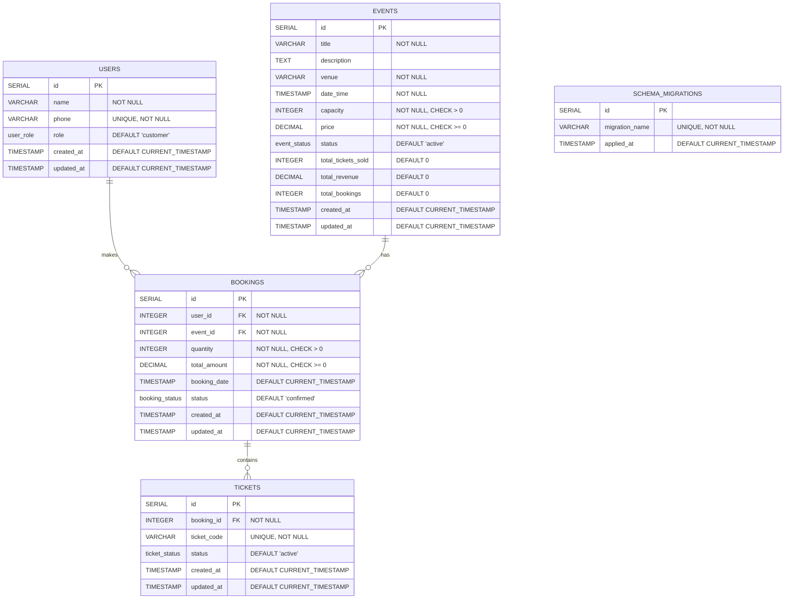
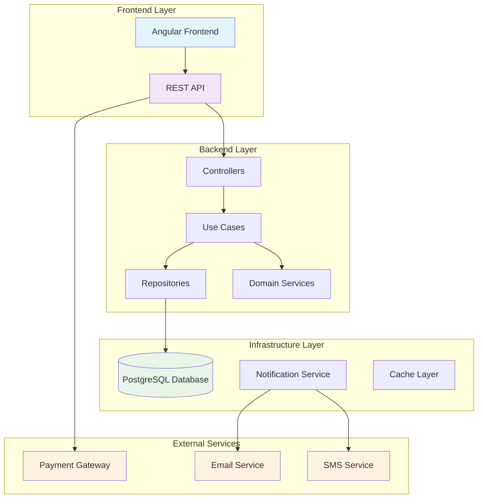
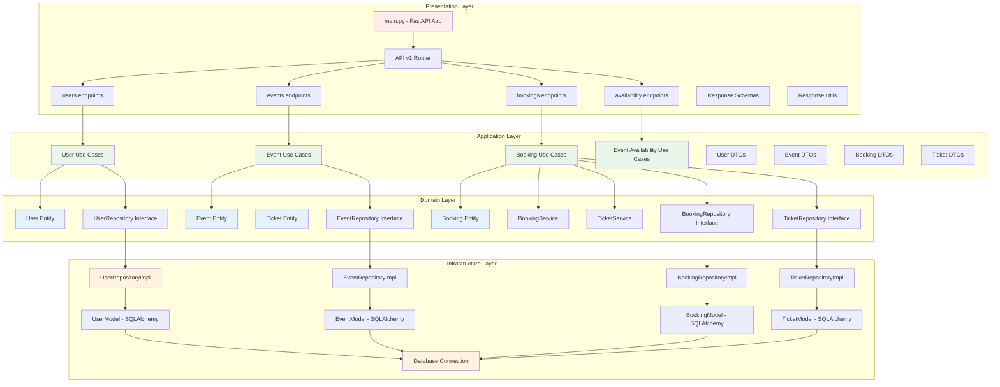
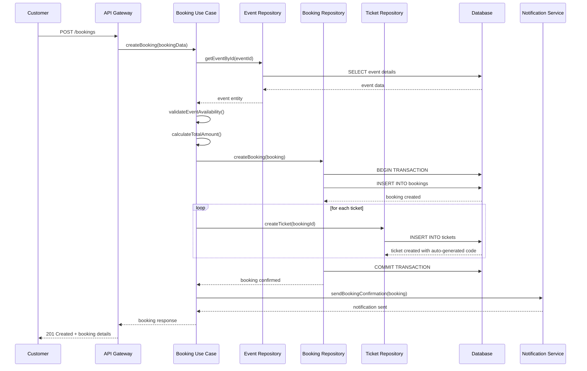
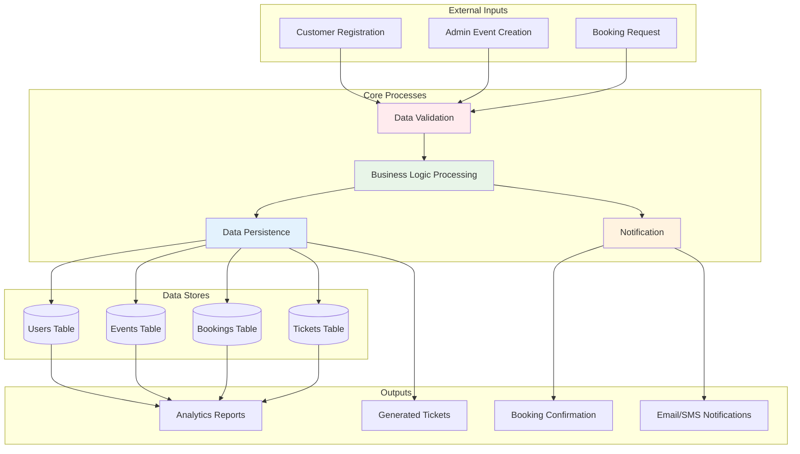
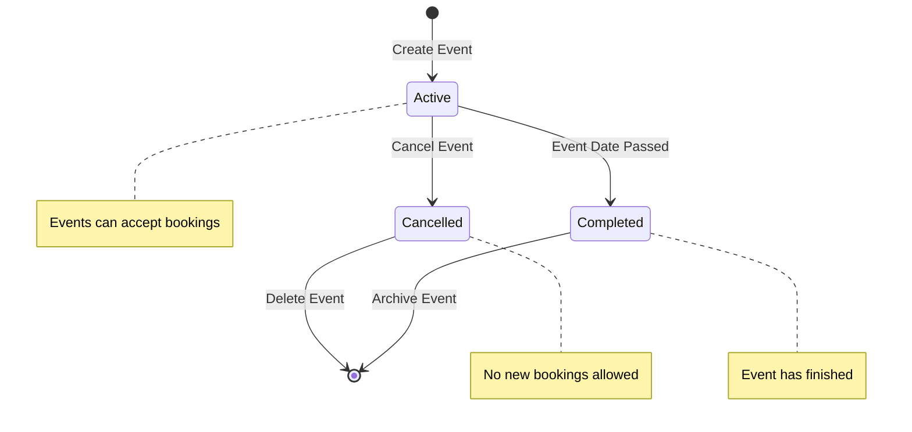
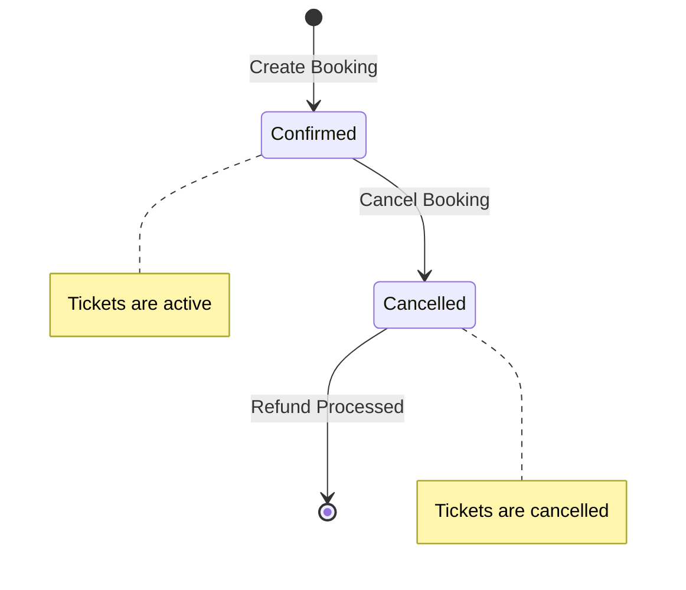
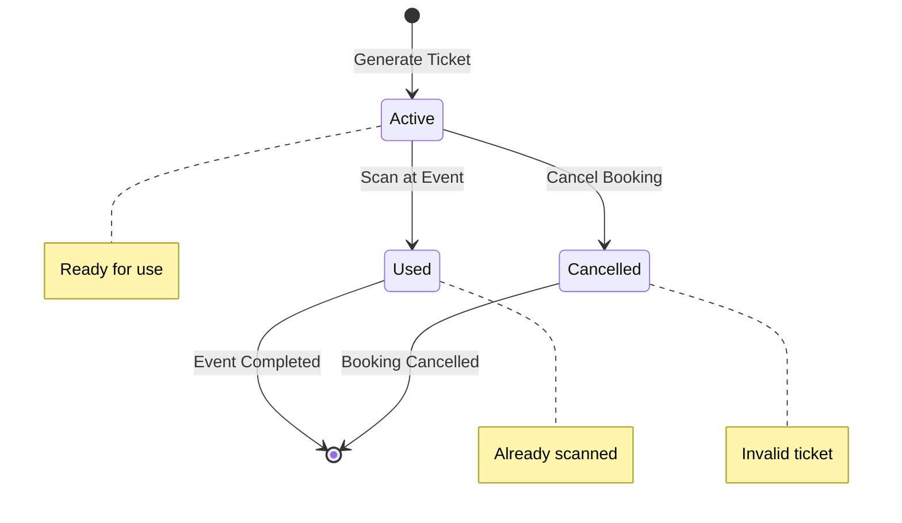
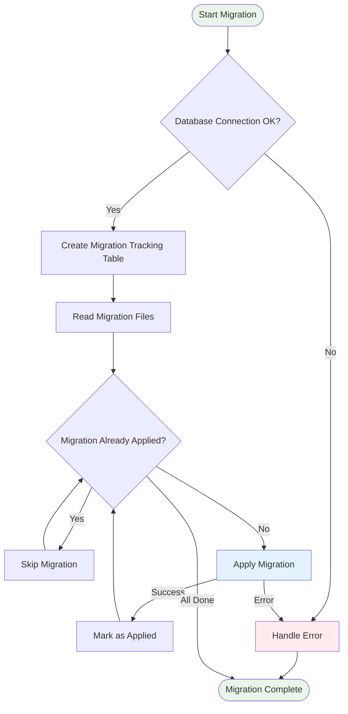

# Event Ticketing System - Diagrams

## 1. Entity Relationship Diagram (ERD)



## 2. System Architecture Diagram



## 3. Clean Architecture Layers (จริงในโปรเจ็กต์)



## 4. Booking Flow Diagram



## 5. Database Triggers and Functions Flow

```mermaid
graph TB
    subgraph "Insert/Update Operations"
        INS_TICKET[Insert Ticket]
        UPD_USER[Update User]
        UPD_EVENT[Update Event]
        UPD_BOOKING[Update Booking]
        INS_BOOKING[Insert Booking]
    end
    
    subgraph "Trigger Functions"
        GEN_CODE[generate_ticket_code()]
        UPDATE_TS[update_updated_at_column()]
        CHECK_CAP[check_booking_capacity()]
        UPDATE_STATS[update_event_statistics()]
    end
    
    subgraph "Validations & Auto-generation"
        UNIQUE_CODE[Ensure Unique Ticket Code]
        TIMESTAMP[Update Timestamp]
        CAPACITY[Validate Capacity]
        STATS[Update Event Stats]
    end
    
    INS_TICKET --> GEN_CODE
    GEN_CODE --> UNIQUE_CODE
    
    UPD_USER --> UPDATE_TS
    UPD_EVENT --> UPDATE_TS
    UPD_BOOKING --> UPDATE_TS
    UPDATE_TS --> TIMESTAMP
    
    INS_BOOKING --> CHECK_CAP
    CHECK_CAP --> CAPACITY
    
    INS_BOOKING --> UPDATE_STATS
    UPD_BOOKING --> UPDATE_STATS
    UPDATE_STATS --> STATS
    
    style INS_TICKET fill:#e1f5fe
    style INS_BOOKING fill:#e1f5fe
    style GEN_CODE fill:#f3e5f5
    style CHECK_CAP fill:#ffebee
    style UPDATE_STATS fill:#e8f5e8
```

## 6. API Endpoints Structure (จริงในโปรเจ็กต์)

```mermaid
graph LR
    subgraph "FastAPI Application"
        MAIN[main.py]
        MAIN --> API_V1[/api/v1/]
    end
    
    subgraph "User Management"
        API_V1 --> USER_EP[/api/v1/users]
        USER_EP --> USER_GET[GET /users]
        USER_EP --> USER_POST[POST /users]
        USER_EP --> USER_PUT[PUT /users/:id]
        USER_EP --> USER_GET_ID[GET /users/:id]
        USER_EP --> USER_GET_PHONE[GET /users/phone/:phone]
    end
    
    subgraph "Event Management"
        API_V1 --> EVENT_EP[/api/v1/events]
        EVENT_EP --> EVENT_GET[GET /events]
        EVENT_EP --> EVENT_POST[POST /events]
        EVENT_EP --> EVENT_PUT[PUT /events/:id]
        EVENT_EP --> EVENT_PATCH[PATCH /events/:id]
        EVENT_EP --> EVENT_GET_ID[GET /events/:id]
        EVENT_EP --> EVENT_DELETE[DELETE /events/:id]
    end
    
    subgraph "Booking Management"
        API_V1 --> BOOKING_EP[/api/v1/bookings]
        BOOKING_EP --> BOOKING_GET[GET /bookings]
        BOOKING_EP --> BOOKING_POST[POST /bookings]
        BOOKING_EP --> BOOKING_GET_ID[GET /bookings/:id]
        BOOKING_EP --> BOOKING_USER[GET /bookings/user/:user_id]
        BOOKING_EP --> BOOKING_EVENT[GET /bookings/event/:event_id]
        BOOKING_EP --> BOOKING_STATS[GET /bookings/stats/:event_id]
    end
    
    subgraph "Availability Management"
        API_V1 --> AVAIL_EP[/api/v1/availability]
        AVAIL_EP --> AVAIL_GET[GET /availability]
        AVAIL_EP --> AVAIL_EVENT[GET /availability/:event_id]
    end
    
    subgraph "System Endpoints"
        MAIN --> ARCH[GET /api/v1/architecture]
        MAIN --> VERSION[GET /api/v1/version]
        MAIN --> HEALTH[GET /health]
    end
    
    style MAIN fill:#e1f5fe
    style USER_EP fill:#f3e5f5
    style EVENT_EP fill:#e8f5e8
    style BOOKING_EP fill:#fff3e0
    style AVAIL_EP fill:#f1f8e9
```

## 7. Data Flow Diagram



## 8. State Transition Diagrams

### Event Status States



### Booking Status States



### Ticket Status States



## 9. Migration Process Flow


