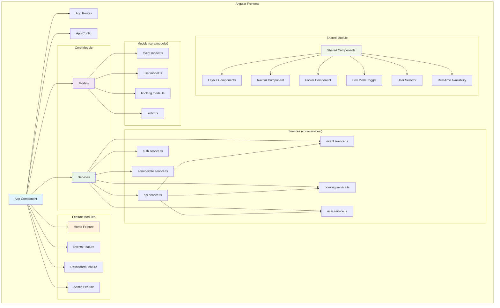
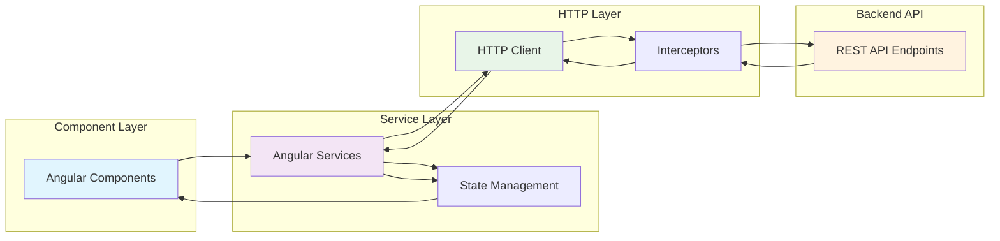
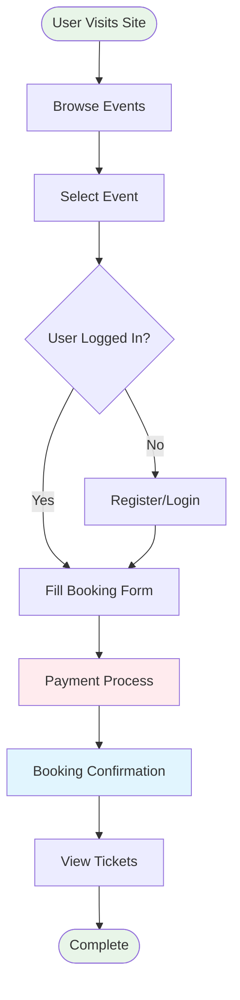

# Event Ticketing System - Frontend

A modern, responsive Angular frontend application for the Event Ticketing System, built with Angular 19, TailwindCSS, and featuring real-time ticket availability, booking management, and admin panel functionality.

## 🚀 Features

- **Modern Angular 19**: Latest Angular framework with standalone components and SSR support
- **Responsive Design**: Mobile-first design with TailwindCSS
- **Real-time Updates**: Live ticket availability tracking and automatic refresh
- **User Management**: Customer and admin role-based interface
- **Event Discovery**: Browse, search, and filter events with detailed views
- **Booking System**: Seamless ticket booking with real-time validation
- **Admin Panel**: Complete event management and booking oversight
- **Dev Mode**: Toggle between mock data and real API for development
- **Performance Optimized**: Lazy loading, caching, and efficient data management

## 📋 Requirements

- Node.js 18+
- npm 9+ or yarn
- Angular CLI 19.2.15+
- Backend API running on `http://localhost:8000`

## 🛠️ Installation & Setup

### 1. Clone and Navigate

```bash
cd front-end
```

### 2. Install Dependencies

```bash
npm install
# or
yarn install
```

### 3. Start Development Server

```bash
ng serve
# or
npm start
```

The application will be available at:

- **Frontend**: http://localhost:4200
- **Auto-reload**: Changes automatically reload the browser

### 4. Backend Connection

Ensure the backend API is running on `http://localhost:8000`.
See backend README for setup instructions.

## 🎨 Available Scripts

```bash
# Development server
ng serve                    # Start dev server at http://localhost:4200
npm start                   # Alternative start command

# Building
ng build                    # Build for production
ng build --watch            # Build and watch for changes

# Testing
ng test                     # Run unit tests with Karma
ng e2e                      # Run end-to-end tests (when configured)

# SSR (Server-Side Rendering)
npm run serve:ssr:front-end # Serve with SSR

# Code generation
ng generate component name  # Generate new component
ng generate service name    # Generate new service
ng generate module name     # Generate new module
```

## 🏗️ Project Architecture

### Clean Architecture Structure

```
src/
├── app/
│   ├── core/                     # Singleton services, models, guards
│   │   ├── models/              # Data models and interfaces
│   │   │   ├── event.model.ts
│   │   │   ├── user.model.ts
│   │   │   ├── booking.model.ts
│   │   │   └── index.ts
│   │   └── services/            # Core business services
│   │       ├── api.service.ts           # HTTP client wrapper
│   │       ├── auth.service.ts          # Authentication management
│   │       ├── event.service.ts         # Event data management
│   │       ├── booking.service.ts       # Booking operations
│   │       ├── user.service.ts          # User management
│   │       ├── admin-state.service.ts   # Admin state management
│   │       ├── dev-mode.service.ts      # Development mode toggle
│   │       ├── ticket-availability.service.ts  # Real-time availability
│   │       └── index.ts
│   ├── features/                 # Feature modules
│   │   ├── home/                # Landing page
│   │   ├── events/              # Event browsing and details
│   │   │   ├── event-list.component.*
│   │   │   ├── event-detail.component.*
│   │   │   └── components/      # Event-specific components
│   │   ├── dashboard/           # User dashboard and bookings
│   │   │   └── user-dashboard.component.*
│   │   └── admin/               # Admin management panel
│   │       ├── admin-panel.component.*
│   │       ├── create-event/
│   │       └── manage-events/
│   ├── shared/                   # Reusable components
│   │   ├── components/
│   │   │   ├── layout/          # Main layout wrapper
│   │   │   ├── navbar/          # Navigation bar
│   │   │   ├── footer/          # Footer component
│   │   │   ├── dev-mode-toggle/ # Development mode switcher
│   │   │   ├── user-selector/   # User selection dropdown
│   │   │   └── real-time-availability/  # Live availability display
│   │   └── shared.module.ts
│   ├── app.component.*           # Root component
│   ├── app.routes.ts            # Application routing
│   └── app.config.ts            # App configuration
├── environments/                 # Environment configurations
│   ├── environment.ts           # Development settings
│   └── environment.prod.ts      # Production settings
├── styles.css                   # Global styles with TailwindCSS
└── index.html                   # Main HTML template
```

## 🎯 Key Components

### Event Management

- **Event List**: Browse all available events with filtering and search
- **Event Detail**: Detailed event information with real-time booking
- **Event Cards**: Responsive event display with availability status

### User Experience

- **User Dashboard**: View personal bookings and ticket history
- **User Selector**: Quick switching between different user accounts
- **Real-time Updates**: Live ticket availability and booking confirmation

### Admin Features

- **Admin Panel**: Complete event and booking management
- **Create Event**: Add new events with full validation
- **Manage Events**: Edit, update, and monitor existing events
- **Booking Overview**: Monitor all bookings across events

### Development Tools

- **Dev Mode Toggle**: Switch between mock data and real API
- **Environment Configuration**: Easy switching between dev/prod settings
- **Hot Reload**: Instant updates during development

## 🔧 Configuration

### Environment Settings

```typescript
// src/environments/environment.ts
export const environment = {
    production: false,
    apiUrl: 'http://localhost:8000/api/v1',
    isDevMode: true, // Toggle for using mock data vs real API
}
```

### API Configuration

The frontend connects to the backend API at `http://localhost:8000/api/v1`.
All API calls are managed through the `ApiService` with proper error handling and response transformation.


## 🚀 Features Overview

### Core Functionality

- ✅ **Event Browsing**: View all available events with filtering
- ✅ **Event Details**: Comprehensive event information and booking
- ✅ **User Authentication**: Role-based access (customer/admin)
- ✅ **Booking Management**: Create, view, and manage bookings
- ✅ **Real-time Updates**: Live availability and booking confirmation
- ✅ **Admin Panel**: Complete event and booking administration

### User Interface

- ✅ **Responsive Design**: Works on desktop, tablet, and mobile
- ✅ **Modern UI/UX**: Clean, intuitive interface design
- ✅ **Loading States**: Proper loading indicators and skeleton screens
- ✅ **Error Handling**: User-friendly error messages and recovery
- ✅ **Form Validation**: Client-side validation with clear feedback


## 🔧 Development Mode

### Dev Mode Toggle

The application includes a development mode that allows switching between mock data and real API:

```typescript
// Toggle in DevModeService
toggleDevMode(): void {
  this.isDevMode = !this.isDevMode;
  // Automatically switches data source
}
```

### Mock Data vs Real API

- **Dev Mode ON**: Uses local mock data for rapid development
- **Dev Mode OFF**: Connects to real backend API
- **Seamless Switching**: No code changes required

## 📱 Responsive Design

### Breakpoints

- **Mobile**: < 640px
- **Tablet**: 640px - 1024px
- **Desktop**: > 1024px

### Mobile-First Approach

All components are designed mobile-first with progressive enhancement for larger screens.

## 🔒 Security Considerations

### Production Deployment

- **Environment Variables**: Use environment-specific configurations
- **API Security**: Implement proper authentication tokens
- **HTTPS**: Always use HTTPS in production
- **Content Security Policy**: Implement CSP headers
- **Bundle Security**: Regular dependency audits

## 🚀 Production Build

### Build for Production

```bash
ng build --configuration production
```

### Build Optimizations

- **Tree Shaking**: Removes unused code
- **Minification**: Compressed JavaScript and CSS
- **Bundle Splitting**: Optimized chunk loading
- **Service Worker**: PWA capabilities (if enabled)

### Deployment Options

```bash
# Static hosting (Netlify, Vercel, GitHub Pages)
ng build --configuration production

# Server deployment with SSR
npm run build:ssr
npm run serve:ssr:front-end
```

## 🔍 API Integration

### Backend Connectivity

The frontend integrates with the FastAPI backend:

```typescript
// API Service configuration
const API_BASE_URL = 'http://localhost:8000/api/v1';

// Available endpoints:
// Users
GET    /users                      # List all users
POST   /users                      # Create user
GET    /users/{id}                 # Get user by ID

// Events
GET    /events                     # List all events
GET    /events/{id}                # Get event details
POST   /events                     # Create event (admin)
PUT    /events/{id}                # Update event (admin)
PATCH  /events/{id}                # Partially update event (admin)
DELETE /events/{id}                # Delete event (admin)
GET    /events/management/view     # Get events with statistics

// Bookings
POST   /bookings                   # Create booking
GET    /bookings/{id}              # Get booking by ID
GET    /bookings/user/{id}         # Get user bookings
GET    /bookings/event/{id}        # Get event bookings (admin)
GET    /bookings/event/{id}/stats  # Get booking statistics
PUT    /bookings/{id}/status       # Update booking status (admin)

// Event Availability
GET    /availability/{id}          # Get event availability
GET    /availability               # Get multiple events availability
GET    /availability/all/active    # Get all active events availability

// System
GET    /api                        # Get API version information
GET    /api/v1/architecture         # Get architecture information
```

### Error Handling

- **Network Errors**: Automatic retry with exponential backoff
- **HTTP Errors**: User-friendly error messages
- **Validation Errors**: Field-level error display
- **Offline Support**: Graceful degradation when API unavailable

## 📊 Performance Monitoring

### Bundle Analysis

```bash
ng build --stats-json
npx webpack-bundle-analyzer dist/front-end/stats.json
```

### Performance Metrics

- **First Contentful Paint**: < 1.5s
- **Largest Contentful Paint**: < 2.5s
- **Cumulative Layout Shift**: < 0.1
- **Bundle Size**: < 500KB initial load

## 🤝 Contributing

### Development Workflow

1. **Setup**: Follow installation instructions
2. **Feature Branch**: Create feature branch from `dev`
3. **Development**: Use dev mode for rapid iteration
4. **Testing**: Ensure all tests pass
5. **Build**: Verify production build works
6. **Pull Request**: Submit PR with description

### Code Standards

- **TypeScript**: Strict type checking enabled
- **ESLint**: Code quality and consistency
- **Prettier**: Automatic code formatting
- **Angular Style Guide**: Follow official Angular patterns

## 🔧 Troubleshooting

### Common Issues

**API Connection Problems:**

```bash
# Check if backend is running
curl http://localhost:8000/api/v1/events

# Check environment configuration
# Verify environment.ts has correct apiUrl
```

**Build Errors:**

```bash
# Clear Angular cache
ng cache clean

# Reinstall dependencies
rm -rf node_modules package-lock.json
npm install
```


# Frontend Architecture Diagrams (จริงในโปรเจ็กต์)

## 1. Angular Application Structure (จริงในโปรเจ็กต์)



## 2. Component Hierarchy (จริงในโปรเจ็กต์)



```mermaid
graph TB
    ROOT[App Root]
    
    subgraph "Layout Components (shared/components/)"
        LAYOUT[Layout Component]
        NAVBAR[Navbar Component]
        FOOTER[Footer Component]
        DEV_TOGGLE[Dev Mode Toggle]
        USER_SELECTOR[User Selector]
        REALTIME[Real-time Availability]
    end
    
    subgraph "Feature Pages"
        HOME[Home Feature]
        EVENTS[Events Feature]
        DASHBOARD[Dashboard Feature]
        ADMIN[Admin Feature]
    end
    
    subgraph "Home Components"
        HOME_COMP[Home Page Component]
    end
    
    subgraph "Events Components"
        EVENT_LIST[Event List Component]
        EVENT_CARD[Event Card Component]
        EVENT_DETAIL[Event Detail Component]
    end
    
    subgraph "Dashboard Components"
        DASH_COMP[Dashboard Component]
        BOOKING_LIST[User Bookings List]
        BOOKING_DETAIL[Booking Detail]
    end
    
    subgraph "Admin Components"
        ADMIN_DASH[Admin Dashboard]
        EVENT_MGMT[Event Management]
        USER_MGMT[User Management]
        BOOKING_MGMT[Booking Management]
    end
    
    ROOT --> LAYOUT
    LAYOUT --> NAVBAR
    LAYOUT --> FOOTER
    NAVBAR --> DEV_TOGGLE
    NAVBAR --> USER_SELECTOR
    
    ROOT --> HOME
    ROOT --> EVENTS
    ROOT --> DASHBOARD
    ROOT --> ADMIN
    
    HOME --> HOME_COMP
    HOME_COMP --> REALTIME
    
    EVENTS --> EVENT_LIST
    EVENT_LIST --> EVENT_CARD
    EVENTS --> EVENT_DETAIL
    
    DASHBOARD --> DASH_COMP
    DASHBOARD --> BOOKING_LIST
    BOOKING_LIST --> BOOKING_DETAIL
    
    ADMIN --> ADMIN_DASH
    ADMIN --> EVENT_MGMT
    ADMIN --> USER_MGMT
    ADMIN --> BOOKING_MGMT
    
    style ROOT fill:#e1f5fe
    style LAYOUT fill:#f3e5f5
    style HOME fill:#e8f5e8
    style EVENTS fill:#fff3e0
    style DASHBOARD fill:#f1f8e9
    style ADMIN fill:#fce4ec
```

## 3. State Management Flow



## 4. User Journey Flow



